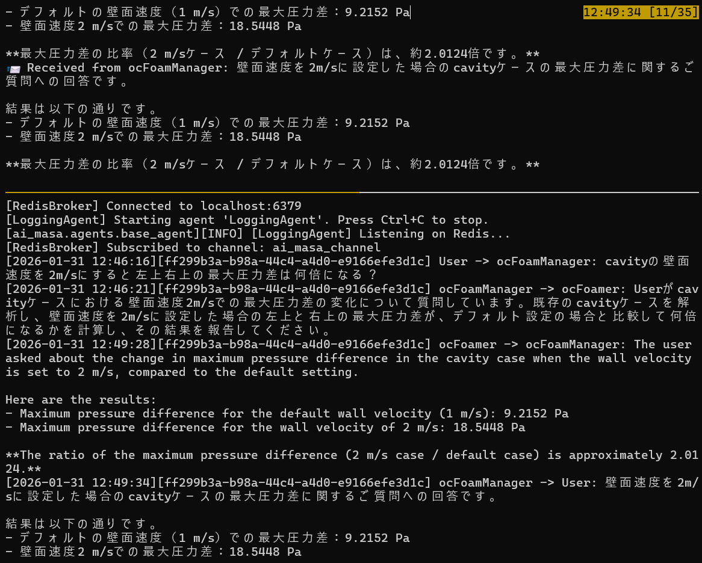
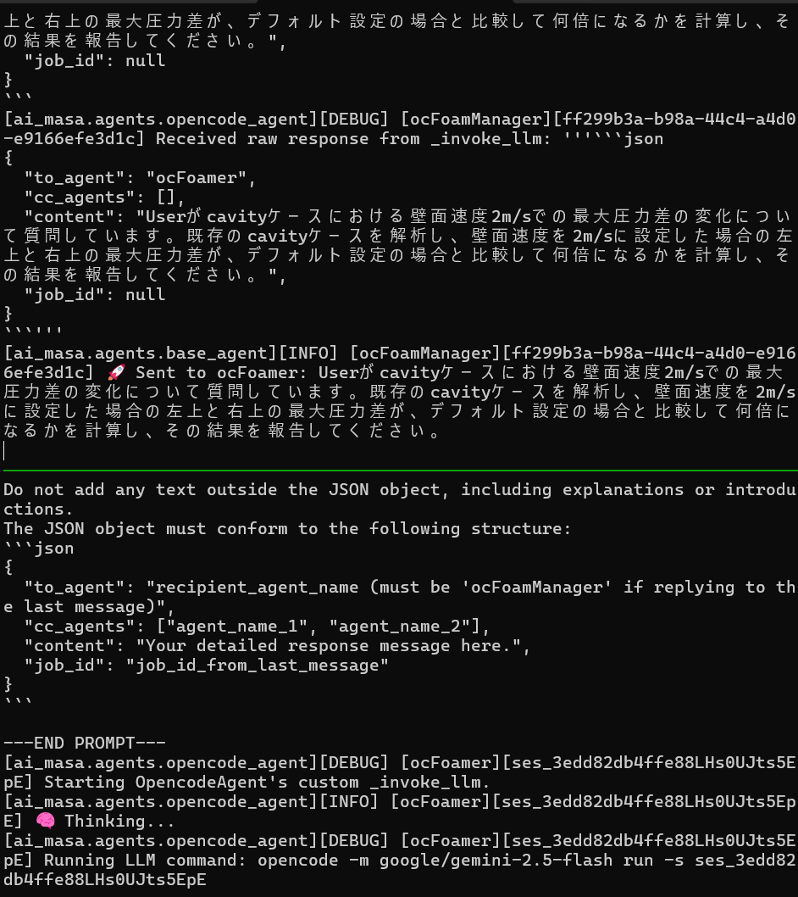
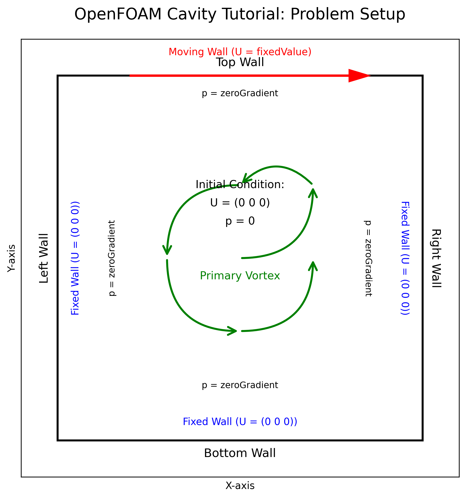

<!-- _class: title-slide -->

# AI組織化による設計支援

## 

第105回　関西CAE懇話会

2026年2月6日

片山 達也

CAE懇話会 オープンCAE学会　AI機械学習委員会

---
# もくじ

 
 

## 自己紹介
 

## 設計者CAEの定義
 

## 未確立CAE x 設計検討
 

## 確立済みCAE x 設計検討
 

## LLMの技術進展と設計検討に必要なスキル、そして今やること

 

## 🤖 ai-masa 

 

## 🤖 ai-masa 事例

 

## 最後に — AI時代の設計者CAEとは

---
# 自己紹介

---
# 自己紹介

---

# 設計者CAEの定義

企業におけるCAEは、初めてもしくはまだ実現できておらず技術的に未確立な**未確立CAE**と、すでに精度確認されて実使用できる**確立済みCAE**を分類できる。

<pre class="mermaid">

graph LR
    subgraph CAE全体
        subgraph 未確立["未確立CAE"]
            TS[トラブルシューティング]
            現象[現象メカニズム分析]
            設計未[設計アイデアを試す]
        end

        subgraph 確立["確立済みCAE"]
            モデル[既存モデルで計算]
            過去[過去設計で適用済み]
            基準[設計基準内か確認]
        end
        
    end
    
    style 設計未 fill:#ffcccc,stroke:#ff0000,stroke-width:1px
    style モデル fill:#ffcccc,stroke:#ff0000,stroke-width:1px
    style 過去 fill:#ffcccc,stroke:#ff0000,stroke-width:1px
    style 基準 fill:#ffcccc,stroke:#ff0000,stroke-width:1px
</pre>

**設計者CAEの定義を設計仕様を検討するためのCAE**とすると、
設計者CAEは、**確立済みCAE**のみならず、**未確立CAE**にも設計者CAEは存在する。

---

# 未確立CAE × 設計検討

## 設計者の困りごと
新しいアイデアを思いついても、検証する手段も時間もなく前に進めない。仕方なく、お蔵入りに。

**新しいアイデアを試す手段がない...**

- ✗ 確立済みCAE → 範囲外で使えない
- △ 実験 → 高コスト・時間がかかる  
- ✗ お蔵入り → イノベーションが止まる

**どうやって試せばいいのか？**

## 設計者本当に欲しいもの
- **設計者が本当に欲しいのは「勝ち目があるかどうか」「時間とお金を投資する価値があるかどうか」の判断材料。**

- **計算で傾向が見れるのであれば、あとは何とかできる。**

---

# 未確立CAE × 設計検討

## Q どうすればアイデアを試せるのか？

  <input type="checkbox" id="a">
  <label for="a">A. 設計者が自分で設計に必要な計算を作る</label>
  
❌ できれば困らない。計算作りながら設計もすると時間がない。

  <input type="checkbox" id="b">
  <label for="b">B. CAE専任者に丸投げ</label>
  
❌ よく聞く話だが、設計制約がたくさん。どこが設計制約か複雑。いい案を出せないし、出にくい。

  <input type="checkbox" id="c">
  <label for="c">C. 何もしない</label>
  
❌ アイデアが死ぬ、イノベーションが止まる

  <input type="checkbox" id="d">
  <label for="d">D. 設計者×CAE専任者で一緒に作る</label>
  
⭕ これしかない。議論をしながら「アイデアを試せる環境」を作る 

---
# 未確立なCAEの適用事例

---
# 未確立なCAEの適用事例

---

# 確立済みCAE × 設計検討　事例１

## 開発トラブルと急な解析依頼編

### 設計仕様検討の計算をCAE専任者に依頼。

<!-- 設計者 左側 -->

設計者

開発トラブルです。仕様を再検討したい。パラメータスタディの計算を依頼します。明日までに結果ください。

<!-- CAE専任者の吹き出し 左側 -->

え、明日？それは無理。手順も作ってあるし、やり方教えるよ。できるようになった方がいいよ。次からは自分で検討できるようになるし。

<!-- CAE専任者 右側 -->

CAE専任者

---
# 確立済みCAE × 設計検討　事例１

## 開発トラブルと急な解析依頼編（本音）

### みんな忙しい。誰かにやってほしい。そう、誰かに...　

  <!-- 設計者 左側 -->

設計者

  

    

      検討する時間ないよ。手順通り、現在の延長線上での設計なので、答えだけでいいのに。できれば依頼書も書くの手間。さくっと<strong>やってほしいな。</strong>
    

  

  <!-- CAE専任者の吹き出し 左側 -->
  

    

      前も頼まれたよ。手順あるんだし、<strong>やってほしいな。</strong>設計者がやるべきじゃないのかな？設計に役立つ発見があるかもだし。
    

  

  <!-- CAE専任者 右側 -->

CAE専任者
<!-- 思考泡（安定版） -->

---
# 確立済みCAE × 設計検討　事例２

## 前向きな設計検討編（ある日の事務所にて）

### 必要な技術と見定めるためにCAEを活用。本当に欲しいものはツールではなく、検討できる技術者。

<!-- 設計者 左側 -->

マネージャ

まさぁ！軸径を細ぉした仕様で検討してくれへんか？どこがきつなるんや？

<!-- CAE専任者の吹き出し 左側 -->

それやりましたよ。効率は0.5pt上がるけど、軸受け部の信頼性が厳しいっすわ。片当たり押さえたらな、あかんですわ。

<!-- CAE専任者 右側 -->

まさ

---
# 確立済みCAE × 設計検討　まとめ
## まとめ

- 事例から分かる現状：設計者は「手早く答えが欲しい」が、時間がなく自ら計算する余裕はない。  
- CAE専任者側も手順やノウハウはあるが、依頼対応だけでは設計意図・制約を汲めず最良の提案が出しにくい。  
- 依頼→回答の一方向ではイノベーションが止まり、設計検討の質が下がるリスクがある。  
- 本当に必要なのは「ツール」ではなく「設計検討を一緒に行える人」：  
    - 早く傾向を出して判断材料を提供できる人（＝設計とCAEの橋渡し）  
    - 設計者と議論しながら試行を進められる技術者  
    - 短時間で使えるライトウェイトな検討フローを回せる人材

## ここまでの結論
- 設計検討の核は「人（協業できる技術者）」であり、ツールはその補助に過ぎない。
* **なら、それ(設計検討)AIにやらせてみませんか？**

---
# LLMの技術進展と設計検討に必要なスキル、そして今やること

## LLMの技術進展
- **トランスフォーマ**／大規模事前学習による汎化能力向上／長文コンテキスト／マルチモーダル対応  
- **ツール利用**（CLI・API呼び出し・プラグイン）による外部操作能力  
- **マルチエージェント協調**

## 設計検討に必要なスキル（一例）
まさの発言「**効率は0.5pt上がるけど、軸受け部の信頼性が厳しいっすわ。片当たり押さえたらな、あかん**」によると
1. **設計変数を変えたときの目的関数の予測計算**ができる(CAE)  
2. **他に何を考慮しないといけないか**を、わかっている
3. 対策を知っていて、考慮したら解が存在しうることを知っている。**（逆問題が解ける）**

## BigTechに負けないための差別化戦略
- **設計検討に必要なスキル**を持たせた**マルチエージェント**戦略。 
    - 狙いは**多目的な性能**（効率、信頼性、コスト）を**多様な立場**（設計者、照査者、審議者）で**議論**。
    - **検討を行うチーム構成**もBigTechにない**企業固有のもの**。
    - 一方、**個々のエージェントの基本性能向上はBigTechに任せる**

---

# 🤖 ai-masa 設計検討エージェント

## プロジェクト概要

`ai-masa` は、複数のLLMエージェントが協調してタスクを遂行する分散型マルチエージェントシステムである。
- 通信基盤: Redis Pub/Sub — 各エージェントは独立プロセスとして動作
- メモリ管理: Redis (RedisJSON) 上の `MemoryManager` が対話履歴と各エージェントの状態を一元管理・永続化
- 入力経路: `UserInputAgent` がユーザー指示を受け取り、目的に応じて思考エージェントへルーティング
- 思考エージェント例: `GeminiCliAgent`, `OpencodeAgent`, `RoleBasedAgent` などが応答・処理を担当
- ロギング: `LoggingAgent` が全通信を記録し、後から対話内容を確認・分析可能
- 2026/2/6現在。各エージェントはシングルタスクしか実行できない。
- masa の名称由来: "Multi Agents System Assistant" または "Mechanism Analysis and Structuring Assistant" の頭文字

### HP
+ HP: https://github.com/TatsuyaKatayama/ai_masa
+ License: MIT
+ Star 1

---

# 🤖 ai-masa ⚙️ システムアーキテクチャ

`ai-masa`は、Pub/Subモデルに基づいた柔軟なマルチエージェントアーキテクチャを採用しています。
中心的なメッセージブローカー（Redis）を介して、各エージェントが他のエージェントと非同期に通信します。

<pre class="mermaid">
graph TD
    subgraph "User Interaction"
        UserInput[UserInputAgent]
    end

    subgraph "Core Infrastructure"
        Broker[(Redis Pub/Sub)]
        Memory["MemoryManager   (RedisJSON)"]
    end

    subgraph "Agent Layer"
        Agent1["Thinking Agent A   e.g., GeminiCliAgent"]
        Agent2["Thinking Agent B   e.g., RoleBasedOpencodeAgent"]
        AgentN["... and so on"]
    end

    subgraph "System Agents"
        Logger[LoggingAgent]
        Manager[AgentManager]
    end

    UserInput -- "Publish" --> Broker
    Broker -- "Subscribe" --> Agent1
    Broker -- "Subscribe" --> Agent2
    Broker -- "Subscribe" --> AgentN
    Broker -- "Subscribe" --> Logger
    Broker -- "Subscribe" --> Manager

    Agent1 -- "Publish" --> Broker
    Agent2 -- "Publish" --> Broker

    Agent1 -- "Read/Write" --> Memory
    Agent2 -- "Read/Write" --> Memory
    UserInput -- "Read/Write" --> Memory
</pre>

- **UserInputAgent**: ユーザーからのテキスト入力を受け取り、指定されたターゲットエージェントへメッセージを送信する。
- **Thinking Agents**: それぞれが特定の役割や能力を持つエージェント群である。LLM（Gemini、OpenAI等）と対話し、思考や応答生成を行う。
- **LoggingAgent**: システム内を流れる全てのメッセージを購読し、ファイルへ記録する。
- **AgentManager**: 各エージェントの稼働状況を監視する。
- **Redis Pub/Sub**: エージェント間のメッセージングを担うブローカーである。
- **MemoryManager**: RedisJSONを利用して、対話履歴（メモリ）やエージェントの状態を永続化・管理する。

---

# 🤖 ai-masa 📦 バッググランドテクノロジー

## 主な技術

- [Python 3.10+](https://www.python.org/)
- [tmuxinator](https://github.com/tmuxinator/tmuxinator) — 協調基盤。マルチプロセス起動
- [Redis 公式サイト](https://redis.io/) — 高速インメモリデータストア
- [opencode-cli](https://github.com/opencode-ai/opencode-cli) - cli　llmエージェントのラッパー
### Redis — エージェントの通信と永続メモリ
- Pub/Sub: 各エージェントは独立プロセスでRedisのPublish/Subscribeを使い非同期にメッセージを送受信。疎結合で柔軟な連携が可能。
- RedisJSON（永続メモリ）: 対話履歴やセッション情報をJSONで保存し、再起動後も文脈を復元してタスク継続が可能。

### Opencode — LLMエージェントのツール実行
- ツール実行の付与: Opencode CLI経由でファイル操作やシェルコマンド等の「ツール」をLLMが利用可能にする。
- バックエンドの: config/opencode/config.jsonで操作範囲を厳密に制限し、安全性を担保。
- 永続セッション: 起動時のセッションIDを一貫して使うことでエージェントは複雑なタスクを遂行できる。

---
# 🤖 ai-masa 実行の様子

---
# 🤖 ai-masa 事例）本日の登場人物
マルチエージェントシステムにおける登場人物を紹介してもらう。

<iframe src="./data/self_introduction.html" width="100%" height="500"></iframe>

---
# 🤖 ai-masa 事例）計算の例題(cavity flow)
本日の計算例題に使う、cavity flowについて紹介してもらう。

<iframe src="./data/draw_cavity_flow.html" width="100%" height="500"></iframe>

---
# 🤖 ai-masa 事例）計算の例題(cavity flow)

**問題の概要:**
2次元の正方形領域内における層流、非圧縮性流体の流れをシミュレートする古典的なCFDベンチマーク問題です。3つの固定壁と、一定の接線速度で移動する上壁で構成されます。これにより、キャビティ内に主要な渦が形成されるのが特徴です。

**物理現象:** 層流、非圧縮性、ニュートン流体の流れ、運動量輸送、渦形成。
**支配方程式:** 非圧縮性Navier-Stokes方程式（連続の式、運動量方程式）。
**計算領域:** 2次元の正方形キャビティ。
**境界条件:**
-   **上壁:** 速度 `fixedValue` (指定された接線速度)、圧力 `zeroGradient`。
-   **その他3壁:** 速度 `fixedValue (0 0 0)` (滑りなし条件)、圧力 `zeroGradient`。
-   **前後面 (2Dシミュレーションの場合):** `empty`。
**初期条件:** 全領域で速度 `(0 0 0)`、圧力 `0`。

まぁまぁ。**あなたなら何点つけますか？**　

---
# 🤖 ai-masa 事例）cavity flowの計算検討をする（順問題を解く）
cavity flowのパラメータを変更して計算する。

<iframe src="./data/calc_cavity_flow.html" width="100%" height="500"></iframe>

---
# 🤖 ai-masa 事例）cavity flowの壁面速度を設計させる（逆問題を解く）
1変数の最適化問題。**ちょっと怪しい。嘘ついてるのでは？**

<iframe src="./data/optDesgin03c.html" width="100%" height="500"></iframe>

---
# 🤖 ai-masa 事例）cavity flowの壁面速度を設計させる（逆問題を解く）
作成されたレポート。うーん。

<iframe src="./data/opt1_report.html" width="100%" height="500"></iframe>

---
# 🤖 ai-masa 事例）cavity flowの壁面速度を設計させる（逆問題を解く）
コンテキストを修正し再実行。

<iframe src="./data/opt2_cavity_flow.html" width="100%" height="500"></iframe>

---
# 🤖 ai-masa 事例）cavity flowの壁面速度を設計させる（逆問題を解く）
作成されたレポート。まぁ。まぁ。まぁ。。

<iframe src="./data/optimization_report.html" width="100%" height="500"></iframe>

---
# 🤖 ai-masa 事例）設計検討エージェントに関するまとめ

- 設計検討エージェントをマルチエージェントシステムai-masaにて構築以下の計算について、確認できた。
    - OpenFOAM cavity計算（順問題）
    - cavity caseにおける任意圧力となる壁面速度設計（逆問題）

- マルチエージェントのスキルとして下記の確認ができた。
    - OpenFOAMの計算
    - スクリプト生成による計算の自動化
    - レポート作成機能

- 見つかった課題
    - エージェントディレクトリの使い方が煩雑

- 今後
    - マルチジョブ対応（複数個のボール）
    - MCPサーバを使ったエージェント
    - 一緒に取り組んでくれる仲間（AIではなく、人、企業）

---
# 最後に — AI時代の設計者CAEとは

AI時代の設計者CAEは単なるツールではなく、迅速な設計判断・技術継承・組織的価値創出を担う存在といえる。

### 設計者にとって
- 優秀な設計アシスタント：短時間で傾向を示し、投資判断（やる価値があるか）を出す。  
- 実務負荷を下げて試作・実験の判断を迅速化。アイデアの死蔵を防ぐ。

### CAE専任者にとって
- 技術の伝承先：手順やノウハウをAIで形式化・自動化し、若手や設計現場へ効率的に展開。  
- 例外対応や高度検証に集中できるようになり、専門性をより高付加価値領域へ注力可能にする。

### マネージャーにとって
- チームに必要なAIを見極めて導入・育成することで、メンバーの業務効率化とプロセス改善を図り、チームの継続的な能力向上を促進する。

### 経営層にとって
- 競合他社やBigTechに勝つため、自社の強みを最大限に引き出した人とAIの融合した組織を作る必要がある。

<!-- Mermaidを読み込み -->

